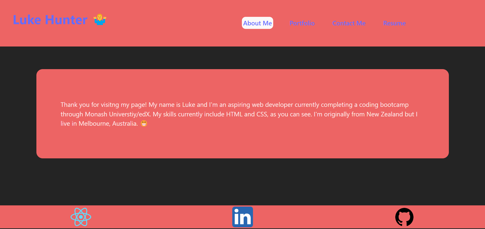

# React Portfolio

https://sparkling-dolphin-ec440f.netlify.app/

## Description

In this program I built an online portfolio using React. I did this to gain a deeper understanding of building a web app front end with React. I also wanted a way to show my developing skills as a web developer by showcasing my portfolio of completed projects.

- [Installation](#installation)

- [License](#license)

- [Usage](#usage)

## Installation

No installation needed. This web app is hosted on Netlify.

## Usage

The portfolio includes sections for 'About Me', 'Portfolio', 'Contact Me', and 'Resume'.

## License

This software is licensed under the MIT license.

## Badges

- [Badges](#badges)
